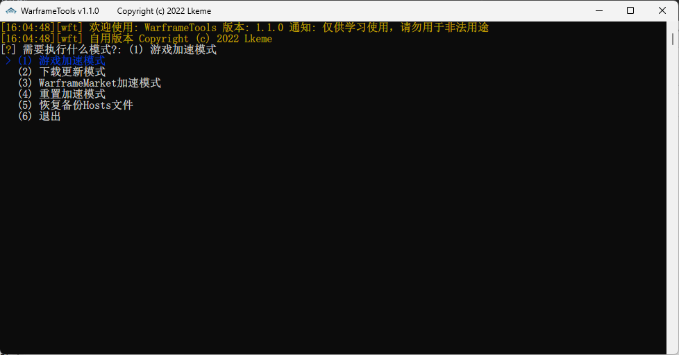

# WarframeTools

`WarframeTools` 是 [Warframe 国际服PC版本](https://www.warframe.com/zh-hans) 的衍生应用，用于改善本地网络到Warframe、Warframe
Market服务器的网络链接。

# 运行

# 用户群体

加速器质量不佳或者想撇开加速器就可以畅玩游戏的玩家。

# 关于

本软件只是一个小工具，不会收集任何用户数据，也不会对用户的游戏体验造成任何影响。

只为学习和交流使用，不得用于商业用途。

如果侵权，请留言联系我删除。

## 🎁 打赏支持

如果觉得本项目好用，对你有所帮助，欢迎打赏支持本项目，请作者喝杯奶茶可乐哦。

